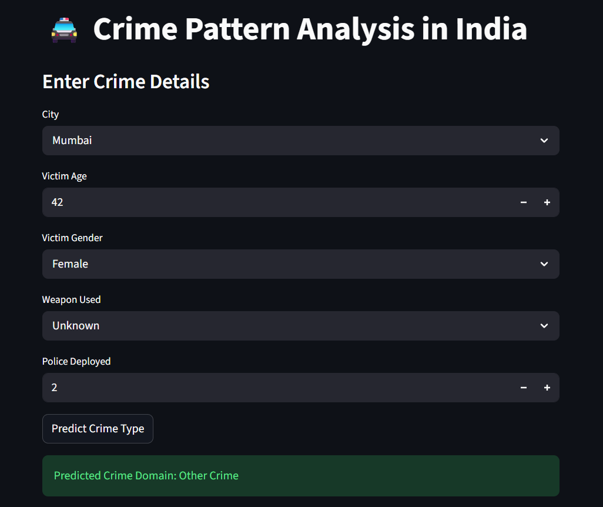
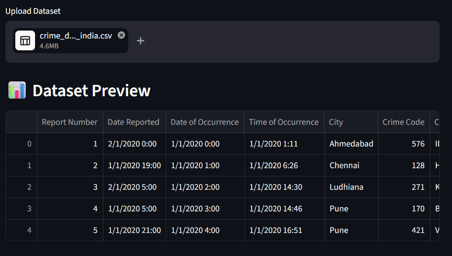
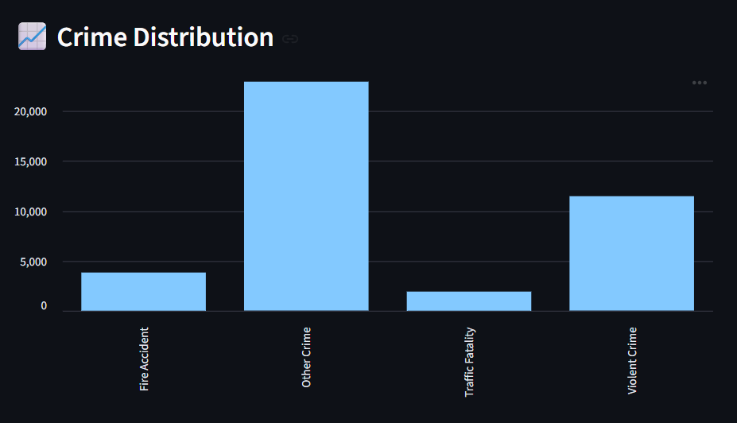

# 🚔 Crime Pattern Analysis in India using Machine Learning

This project focuses on analyzing and predicting crime patterns in India using Machine Learning techniques. It helps identify trends, visualize crime distribution, and assist in decision-making for safety and governance. By leveraging historical crime data, the model identifies trends, patterns, and key factors contributing to criminal activities. The goal is to assist in better decision-making, crime prevention strategies, and resource allocation.

---

## 🎯 Objectives
- Analyze crime data across different regions
- Identify patterns and trends
- Build a predictive model for crime classification
- Develop an interactive UI for visualization

---

## 🧠 Features
- 📊 Data preprocessing and cleaning
- 📈 Exploratory Data Analysis (EDA)
- 🤖 Machine Learning model training
- 📉 Model evaluation (accuracy, classification report)
- 💻 Interactive UI using Streamlit

---

## 🛠️ Tech Stack
- Python
- Pandas, NumPy
- Matplotlib, Seaborn
- Scikit-learn
- Streamlit
- Jupyter
---


## 📊 Dataset

**File:** `data/crime_dataset_india.csv`

| Column | Description |
|---|---|
| Report Number | Unique ID for each crime report |
| Date Reported | Date the crime was reported |
| Date of Occurrence | Actual date of the crime |
| Time of Occurrence | Time the crime occurred |
| City | City where the crime took place |
| Crime Code | Numeric code for crime type |
| Crime Description | Detailed description of the crime |
| Victim Age | Age of the victim |
| Victim Gender | Gender of the victim |
| Weapon Used | Weapon involved (if any) |
| Crime Domain | Category/domain of the crime (Target Variable) |
| Police Deployed | Number of police personnel deployed |
| Case Closed | Whether the case was closed |
| Date Case Closed | Date the case was closed |

---

## 🧠 ML Pipeline

### 1. Data Preprocessing
- Removed duplicates
- Filled missing values (median for age, "Unknown" for weapons)
- Parsed and extracted date/time features

### 2. Exploratory Data Analysis (EDA)
- Top cities by crime count
- Crime domain distribution
- Yearly crime trends

### 3. Classification (Random Forest)
- **Target:** `Crime Domain`
- **Model:** `RandomForestClassifier` (100 estimators)
- **Split:** 80% train / 20% test
- **Metrics:** Accuracy, Classification Report

### 4. Clustering (K-Means)
- Grouped cities into 5 clusters based on crime count
- Visualized hotspot clusters on a scatter plot

---

## 🚀 Getting Started

### 1. Clone the Repository
```bash
git clone https://github.com/aayu04shi/Crime-Anaylis-in-India.git
cd crime-analysis
```

### 2. Install Dependencies
```bash
pip install -r requirements.txt
```

### 3. Run the Notebook
```bash
jupyter notebook notebooks/ML_Model_CrimeAnalysis.ipynb
```
---

## 📦 Requirements

See `requirements.txt` for the full list. Key libraries:
- `pandas`, `numpy` – Data manipulation
- `matplotlib`, `seaborn` – Visualization
- `scikit-learn` – ML models (Random Forest, K-Means)
- `jupyter` – Notebook environment

---

## 📈 Results

| Metric | Value |
|---|---|
| Model | Random Forest Classifier |
| Number of Clusters | 5 (K-Means) |
| Target Variable | Crime Domain |

---

## 📁 Repository Structure

```
Crime-Analysis-in-India/
│
├── README.md                         # Project documentation
├── requirements.txt                  # Dependencies
├── .gitignore                        # Ignored files
├── main.py                           # ML pipeline runner
│
├── data/
│   └── crime_dataset_india.csv       # Dataset
│
├── notebooks/
│   └── ML_Model_CrimePatternAnalysis.ipynb   # Notebook
│
├── src/
│   ├── data_preprocessing.py         # Preprocessing
│   ├── train_model.py                # Model training
│   └── evaluate.py                   # Evaluation
│
├── models/
│   └── README.txt                    # Note about external model
│
├── app/
│   └── app.py                        # Streamlit UI
│
├── outputs/
│   ├── dataset_preview.png           # Dataset screenshot
│   ├── graph.png                     # Visualization
│   ├── prediction.png                # Model output
│   └── ui.pdf                        # UI screens / report
```

---
## 📸 Screenshots [User Interface]

### 🔹 Prediction Output


### 🔹 Dataset Preview


### 🔹 Crime Analysis Graph


## 📄 UI Preview

👉 [Open Live App](https://your-app.streamlit.app)

---


## 👥 Contributors

| Name |
|---|
| Sreeya S. S. |
|---|
| Aayushi P. Naik |
|---|
| Saksham S. Lohote |


---

## 🏆 Leaderboard

👉 [View Full Leaderboard](https://crime-analysis-in-india-jtxuwvnkxxfoqocfzhnzex.streamlit.app/leaderboard)

<!-- LEADERBOARD_START -->
| Rank | GitHub | Model | Accuracy |
|------|--------|--------|----------|
| 1 | Aayushi | RandomForest | 85.0% |
<!-- LEADERBOARD_END -->

---

### 📌 How to Participate

1. Clone the repository  
2. Run the project and train the model  
3. Enter your GitHub username in the app  
4. Your score will be saved in `leaderboard.csv`  
5. Push your changes:

```bash
git add leaderboard.csv
git commit -m "Added my score"
git push


